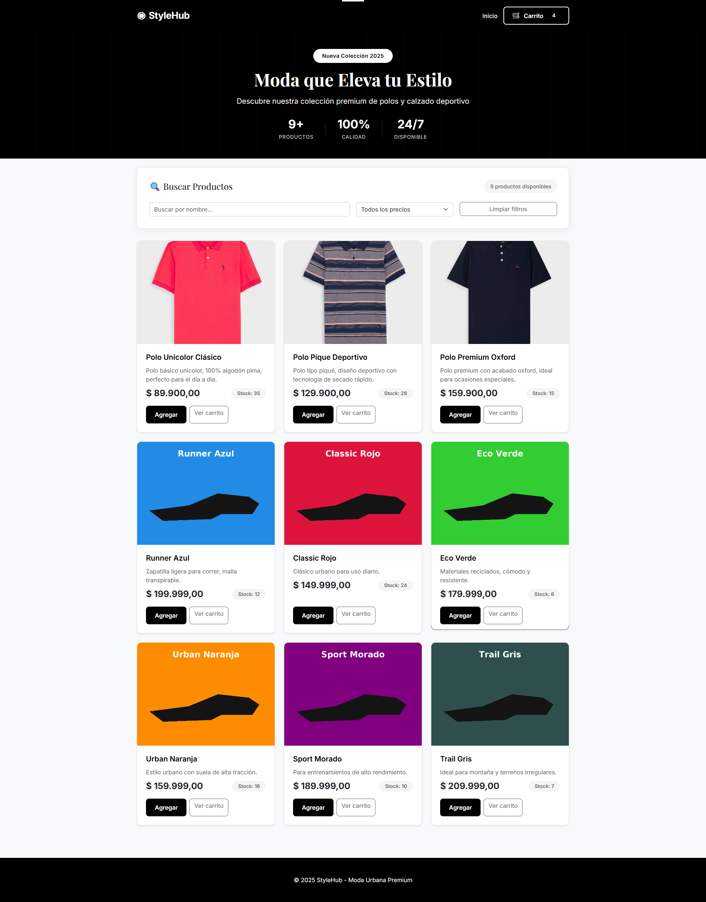
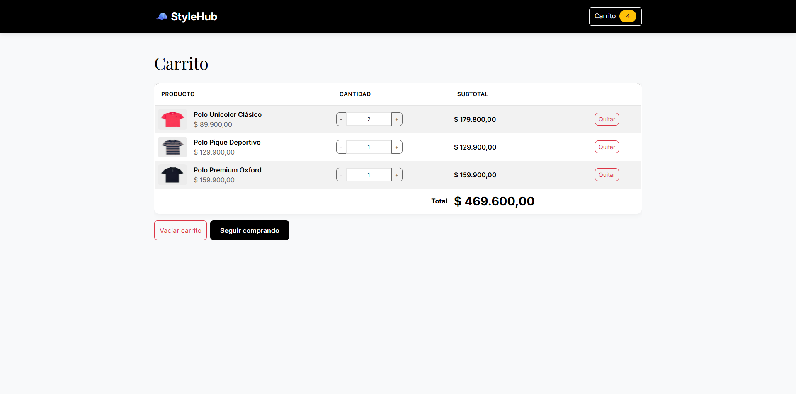
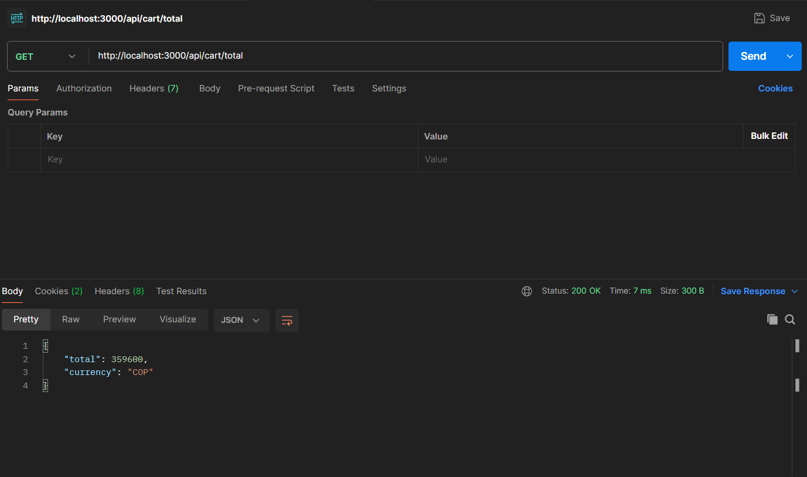

# Instrucciones de Instalación y Configuración - StyleHub

Este documento explica paso a paso cómo instalar, configurar y ejecutar el proyecto StyleHub, una aplicación web de comercio electrónico desarrollada con TypeScript, Express, Bootstrap y tecnologías modernas.

## 📋 Tabla de Contenidos

1. [Requisitos Previos](#requisitos-previos)
2. [Instalación](#instalación)
3. [Configuración del Entorno](#configuración-del-entorno)
4. [Ejecución del Proyecto](#ejecución-del-proyecto)
5. [Verificación del Sistema](#verificación-del-sistema)
6. [Pruebas con Postman](#pruebas-con-postman)
7. [Estructura del Proyecto](#estructura-del-proyecto)

---

## 🔧 Requisitos Previos

Antes de comenzar, asegúrate de tener instalado en tu sistema:

- **Node.js**: versión 18 o superior
- **npm**: gestor de paquetes de Node.js (viene incluido con Node.js)

### Verificar Instalación

Abre una terminal (PowerShell, CMD, o terminal de tu sistema) y ejecuta:

```bash
node --version
npm --version
```

Deberías ver las versiones instaladas. Si no tienes Node.js instalado, descárgalo desde [nodejs.org](https://nodejs.org/).

---

## 📦 Instalación

### Paso 1: Clonar o Descargar el Proyecto

Si tienes acceso al repositorio Git:

```bash
git clone [URL_DEL_REPOSITORIO]
cd zapateria-app
```

Si ya tienes el proyecto descargado, navega a la carpeta del proyecto:

```bash
cd ruta/de/tu/proyecto/zapateria-app
```

### Paso 2: Instalar Dependencias

Ejecuta el siguiente comando para instalar todas las dependencias necesarias:

```bash
npm install
```

Este comando leerá el archivo `package.json` e instalará:
- **Dependencias principales**: express, cors, cookie-session
- **Dependencias de desarrollo**: typescript, tsx, @types/express, etc.

**Salida esperada:**
```
added 123 packages, and audited 123 packages in 6s

16 packages are looking for funding
  run `npm fund` for details

found 0 vulnerabilities
```

✅ **Éxito:** Si ves "found 0 vulnerabilities", la instalación fue correcta.

### Paso 3: Verificar Estructura de Archivos

Asegúrate de que la estructura de carpetas sea la siguiente:

```
zapateria-app/
├── node_modules/          (instalado por npm)
├── public/
│   ├── cart.html
│   ├── index.html
│   ├── css/
│   │   └── style.css
│   ├── js/
│   │   ├── app.js
│   │   └── cart.js
│   └── img/
│       ├── polo_unicolor.webp
│       ├── polo_pique.webp
│       ├── polo_premium.webp
│       ├── shoe_1.png
│       ├── shoe_2.png
│       ├── shoe_3.png
│       ├── shoe_4.png
│       ├── shoe_5.png
│       ├── shoe_6.png
│       ├── vista_principal.png
│       ├── carrito.png
│       └── resultado_postman.png
├── src/
│   ├── routes/
│   │   ├── products.ts
│   │   └── cart.ts
│   ├── types/
│   │   └── index.d.ts
│   └── server.ts
├── package.json
├── package-lock.json
├── tsconfig.json
├── .gitignore
├── README.md
└── INSTRUCCIONES.md
```

---

## ⚙️ Configuración del Entorno

El proyecto viene preconfigurado y no requiere variables de entorno adicionales. Sin embargo, si deseas cambiar el puerto por defecto, edita el archivo `src/server.ts`:

```typescript
const PORT = process.env.PORT || 3000; // Cambia 3000 por el puerto deseado
```

---

## 🚀 Ejecución del Proyecto

### Modo Desarrollo

Para ejecutar el servidor en modo desarrollo con recarga automática:

```bash
npm run dev
```

**Salida esperada:**
```
> zapateria-app@1.0.0 dev
> tsx watch src/server.ts

Servidor escuchando en http://localhost:3000
```

✅ **Indicador de éxito:** Verás el mensaje "Servidor escuchando en http://localhost:3000"

### Modo Producción

Si deseas compilar el proyecto para producción:

**1. Compilar TypeScript a JavaScript:**
```bash
npm run build
```

**2. Ejecutar la versión compilada:**
```bash
npm start
```

---

## ✅ Verificación del Sistema

### Paso 1: Acceder a la Aplicación

Abre tu navegador web favorito y visita:

```
http://localhost:3000
```

Deberías ver la página principal de **StyleHub** con:
- Una barra de navegación negra con el logo
- Un encabezado con estadísticas de productos
- Una sección de búsqueda
- Una cuadrícula de 9 productos (3 polos + 6 zapatillas)



### Paso 2: Probar la Funcionalidad del Carrito

1. Haz clic en el botón "Agregar" de cualquier producto
2. Verifica que el contador del carrito en la barra de navegación aumente
3. Haz clic en "Carrito" en la barra de navegación
4. Verifica que veas los productos agregados con sus cantidades y subtotales



### Paso 3: Probar el Filtro de Búsqueda

1. En la barra de búsqueda, escribe "Polo" o "Runner"
2. Verifica que los productos se filtren en tiempo real
3. Prueba el filtro por rango de precios
4. Haz clic en "Limpiar filtros" para restaurar la vista completa

### Paso 4: Verificar Endpoints de la API

Puedes verificar que los endpoints funcionan correctamente abriendo:

- **Productos**: http://localhost:3000/api/products
- **Carrito**: http://localhost:3000/api/cart

---

## 🧪 Pruebas con Postman

### Configuración Inicial

1. Abre **Postman** (descarga desde [postman.com](https://www.postman.com/downloads/) si no lo tienes)
2. Crea una nueva colección llamada "StyleHub API"

### Probar la Ruta /api/cart/total

La ruta `/api/cart/total` calcula y devuelve el total del carrito en formato JSON.

#### Paso 1: Agregar Productos al Carrito

**Request 1: Agregar Polo Unicolor (2 unidades)**
- **Método:** POST
- **URL:** `http://localhost:3000/api/cart/add`
- **Headers:** 
  - `Content-Type: application/json`
- **Body (raw JSON):**
```json
{
  "productId": 1,
  "qty": 2
}
```

**Request 2: Agregar Polo Premium Oxford (1 unidad)**
- **Método:** POST
- **URL:** `http://localhost:3000/api/cart/add`
- **Headers:** 
  - `Content-Type: application/json`
- **Body (raw JSON):**
```json
{
  "productId": 3,
  "qty": 1
}
```

#### Paso 2: Obtener el Total del Carrito

**Request 3: Calcular Total**
- **Método:** GET
- **URL:** `http://localhost:3000/api/cart/total`
- **Headers:** (ninguno requerido)

**Respuesta Esperada:**
```json
{
  "total": 339700,
  "currency": "COP"
}
```

**Verificación Matemática:**
- Polo Unicolor: 2 × 89,900 = 179,800 COP
- Polo Premium: 1 × 159,900 = 159,900 COP
- **Total:** 339,700 COP ✓



### Otros Endpoints Disponibles

| Método | Endpoint | Descripción |
|--------|----------|-------------|
| GET | `/api/products` | Obtener todos los productos |
| GET | `/api/products/:id` | Obtener un producto por ID |
| GET | `/api/cart` | Obtener el carrito actual |
| POST | `/api/cart/add` | Agregar producto al carrito |
| POST | `/api/cart/remove` | Eliminar producto del carrito |
| POST | `/api/cart/clear` | Vaciar el carrito |
| **GET** | **`/api/cart/total`** | **Calcular total del carrito** |

---

## 📁 Estructura del Proyecto

### Archivos Principales

**Backend (TypeScript):**
- `src/server.ts` - Punto de entrada del servidor Express
- `src/routes/products.ts` - Rutas para gestión de productos
- `src/routes/cart.ts` - Rutas para gestión del carrito (incluye `/total`)
- `src/types/index.d.ts` - Definiciones de tipos TypeScript

**Frontend (HTML/CSS/JavaScript):**
- `public/index.html` - Página principal de productos
- `public/cart.html` - Página del carrito de compras
- `public/css/style.css` - Estilos profesionales en blanco y negro
- `public/js/app.js` - Lógica del cliente para productos y búsqueda
- `public/js/cart.js` - Lógica del cliente para el carrito

**Configuración:**
- `package.json` - Dependencias y scripts del proyecto
- `tsconfig.json` - Configuración de TypeScript
- `.gitignore` - Archivos excluidos de Git

### Características Implementadas

✅ **Personalización del Frontend:**
- Nombre de tienda: StyleHub
- Diseño profesional en blanco y negro
- Fuentes modernas: Inter + Playfair Display
- Diseño responsive con Bootstrap 5

✅ **Ampliación del Catálogo:**
- 3 nuevos productos (polos): Unicolor, Pique, Premium
- Imágenes en formato WebP
- Total de 9 productos en el catálogo

✅ **Filtro de Búsqueda:**
- Búsqueda por nombre en tiempo real
- Filtro por rangos de precio
- Función "Limpiar filtros"
- Contador dinámico de productos

✅ **Ruta Adicional /api/cart/total:**
- Calcula el total del carrito
- Retorna formato JSON con total y moneda
- Integrada con la sesión del usuario

---

## 🛠️ Comandos Útiles

```bash
# Instalar dependencias
npm install

# Ejecutar en modo desarrollo
npm run dev

# Compilar para producción
npm run build

# Ejecutar en producción
npm start

# Ver procesos Node.js activos
Get-Process node

# Detener servidor (Windows PowerShell)
Get-Process node -ErrorAction SilentlyContinue | Stop-Process -Force
```

---

## ⚠️ Solución de Problemas

### Puerto 3000 ya está en uso

**Error:**
```
Error: listen EADDRINUSE: address already in use :::3000
```

**Solución:**
```powershell
# En PowerShell
Get-Process node -ErrorAction SilentlyContinue | Stop-Process -Force

# Luego intenta de nuevo
npm run dev
```

### Dependencias no instaladas

**Error:** `Cannot find module 'express'`

**Solución:**
```bash
# Limpia e instala de nuevo
rm -rf node_modules package-lock.json
npm install
```

### Imágenes no se cargan

**Verificación:**
- Asegúrate de que el servidor esté ejecutándose
- Verifica que las imágenes estén en `public/img/`
- Revisa la consola del navegador para errores 404

---

## 📸 Capturas de Pantalla

El proyecto incluye las siguientes capturas como evidencia de funcionamiento:

1. **vista_principal.png** - Vista principal de la tienda con productos y búsqueda
2. **carrito.png** - Vista del carrito con productos agregados
3. **resultado_postman.png** - Prueba exitosa de la ruta /api/cart/total

---

## 🎯 Características del Sistema

- ✅ Servidor Express con TypeScript
- ✅ Base de datos en memoria para productos
- ✅ Carrito persistente por sesión (cookie-session)
- ✅ Frontend responsive con Bootstrap 5
- ✅ Diseño profesional en blanco y negro
- ✅ Búsqueda y filtrado de productos sin recargar
- ✅ API RESTful completa
- ✅ Cálculo automático de totales
- ✅ Validación de datos de entrada
- ✅ Manejo de errores HTTP
